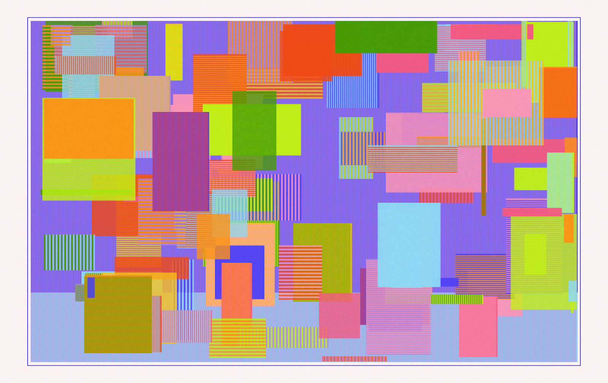
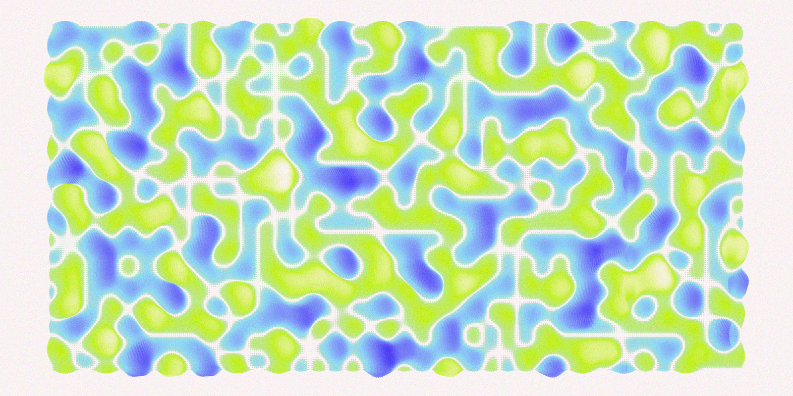
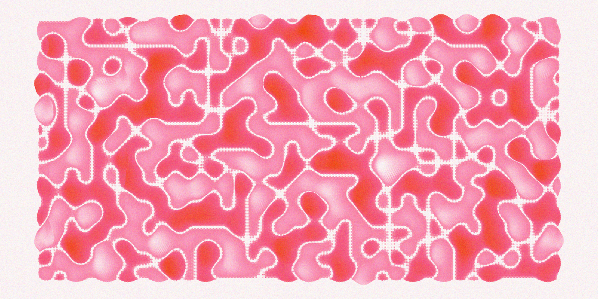

# Genuary 2022

## Day 1: Draw 10,000 of something

## Day 2: Dithering

Gunta Stölzl's [Design for a runner](https://2016kingscliffgreendesign.wordpress.com/2016/03/02/gunta-sholzl/)

## Day 3: Space

## Day 4: The next next Fidenza

## Day 6: Trade styles with a friend

Referencing (blatantly) Ijeamaka Anyene's [work](https://twitter.com/ijeamaka_a/status/1454885928967696387)

## Day 7: Sol LeWitt Wall Drawings

Inspired by [Wall Drawing 413](https://massmoca.org/event/walldrawing413/)

