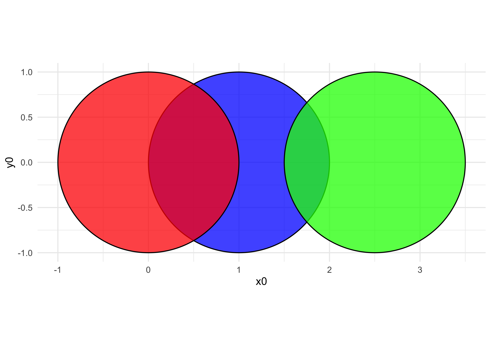
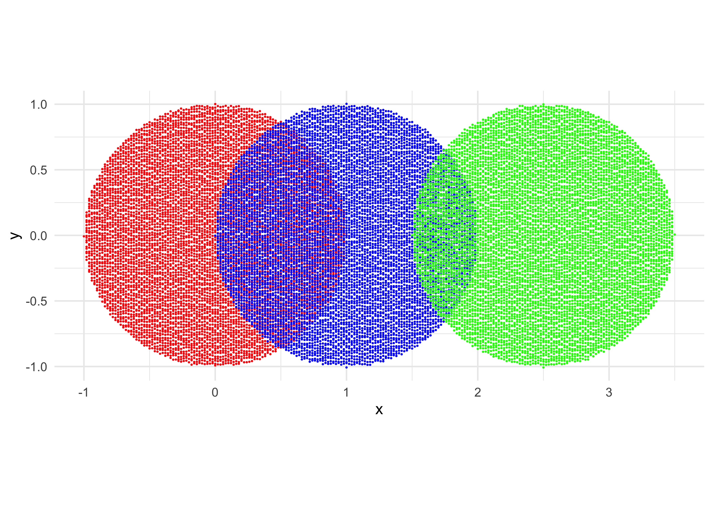
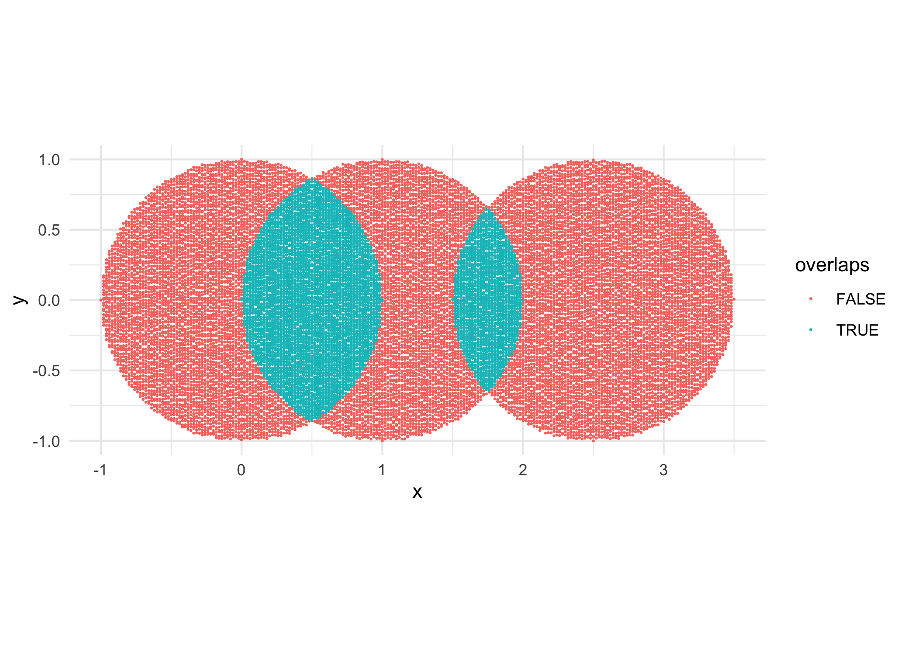
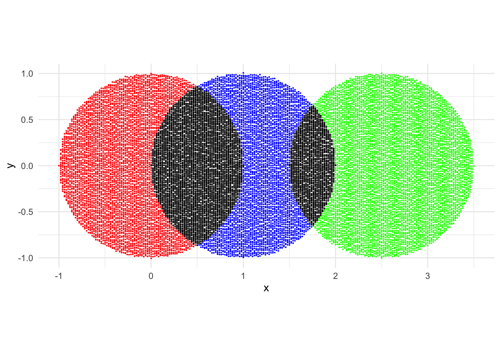

``` r
knitr::opts_chunk$set(dpi = 300)

library(dplyr)
library(tidyr)
library(purrr)
library(ggplot2)
library(ggforce)

theme_set(theme_minimal())
```

Create overlapping circles

``` r
circles <- tribble(
  ~x0, ~y0, ~r, ~colour,
  0, 0, 1, "red",
  1, 0, 1, "blue",
  2.5, 0, 1, "green"
) %>%
  mutate(id = row_number())

ggplot(circles) +
  geom_circle(aes(x0 = x0, y0 = y0, r = r, fill = colour), alpha = 0.75) +
  coord_fixed() +
  scale_fill_identity()
```

<!-- -->

Generate points for each, using Ije’s method - generate grid, then only
keep points within the circle using distance

``` r
distance <- function(x2, x1, y2, y1) {
  sqrt((x2 - x1)^2 + (y2 - y1)^2)
}

generate_points_in_circle <- function(x0, y0, r) {
  circle_grid <- crossing(
    x = seq(x0 - r, x0 + r, 0.02),
    y = seq(y0 - r, y0 + r, 0.02)
  )

  circle_grid %>%
    mutate(distance = distance(x0, x, y0, y)) %>%
    filter(distance <= r)
}

circles_points <- circles %>%
  mutate(points = pmap(list(x0, y0, r), generate_points_in_circle)) %>%
  unnest(points)

circles_points
```

    ## # A tibble: 23,535 × 8
    ##       x0    y0     r colour    id     x       y distance
    ##    <dbl> <dbl> <dbl> <chr>  <int> <dbl>   <dbl>    <dbl>
    ##  1     0     0     1 red        1 -1     0         1    
    ##  2     0     0     1 red        1 -0.98 -0.18      0.996
    ##  3     0     0     1 red        1 -0.98 -0.16      0.993
    ##  4     0     0     1 red        1 -0.98 -0.14      0.990
    ##  5     0     0     1 red        1 -0.98 -0.12      0.987
    ##  6     0     0     1 red        1 -0.98 -0.1       0.985
    ##  7     0     0     1 red        1 -0.98 -0.0800    0.983
    ##  8     0     0     1 red        1 -0.98 -0.0600    0.982
    ##  9     0     0     1 red        1 -0.98 -0.0400    0.981
    ## 10     0     0     1 red        1 -0.98 -0.0200    0.980
    ## # … with 23,525 more rows

``` r
ggplot(circles_points) +
  geom_jitter(aes(x = x, y = y, colour = colour), size = 0.1) +
  coord_fixed() +
  scale_colour_identity()
```

<!-- -->

Now detect the points that overlap the other circles - iterate over each
circle, check the OTHER circles for overlaps using their radii and
center points

``` r
circle_ids <- unique(circles[["id"]])

circles_points_with_overlap <- map_dfr(
  circle_ids,
  function(circle_id) {
    circle_points <- circles_points %>%
      filter(id == circle_id)

    other_circles <- circles %>%
      filter(id != circle_id)

    points_overlaps <- other_circles %>%
      split(.$id) %>%
      map_dfr(function(other_circle) {
        circle_points %>%
          mutate(
            distance = distance(other_circle$x0, x, other_circle$y0, y),
            overlaps = distance <= other_circle$r,
            circle_overlap = ifelse(overlaps, other_circle$id, NA_integer_)
          ) %>%
          filter(overlaps) %>%
          select(x, y, id, overlaps, circle_overlap)
      })
    
    # Filtering by overlaps above and then left joining, otherwise it would
    # return ALL of the points for the circle, for each circle it's checked against
    # - so 2x the points
    # Also because e.g. the very left circle doesn't overlap the very right, 
    # it would return a bunch of FALSE overlaps - but we want only the TRUEs 
    # to change the colours for

    circle_points %>%
      left_join(points_overlaps, by = c("x", "y", "id")) %>%
      mutate(overlaps = coalesce(overlaps, FALSE))
  }
)

circles_points_with_overlap %>%
  count(id, overlaps, circle_overlap)
```

    ## # A tibble: 7 × 4
    ##      id overlaps circle_overlap     n
    ##   <int> <lgl>             <int> <int>
    ## 1     1 FALSE                NA  4776
    ## 2     1 TRUE                  2  3069
    ## 3     2 FALSE                NA  3646
    ## 4     2 TRUE                  1  3069
    ## 5     2 TRUE                  3  1130
    ## 6     3 FALSE                NA  6715
    ## 7     3 TRUE                  2  1130

``` r
circles_points_with_overlap %>%
  ggplot() +
  geom_jitter(aes(x = x, y = y, colour = overlaps), size = 0.1) +
  coord_fixed()
```

<!-- -->

Now change the colour of overlapping points!

``` r
circles_points_with_overlap <- circles_points_with_overlap %>%
  mutate(colour = ifelse(overlaps, "black", colour))

ggplot(circles_points_with_overlap) +
  geom_jitter(aes(x = x, y = y, colour = colour), size = 0.1) +
  coord_fixed() +
  scale_colour_identity()
```

<!-- -->

Or you could do it depending on the overlap, not all the same, etc etc -
just the basic idea
